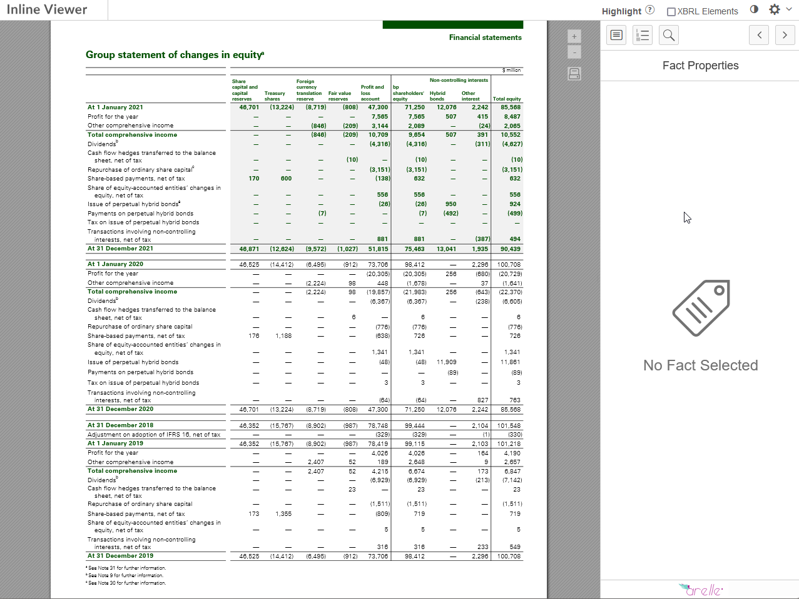
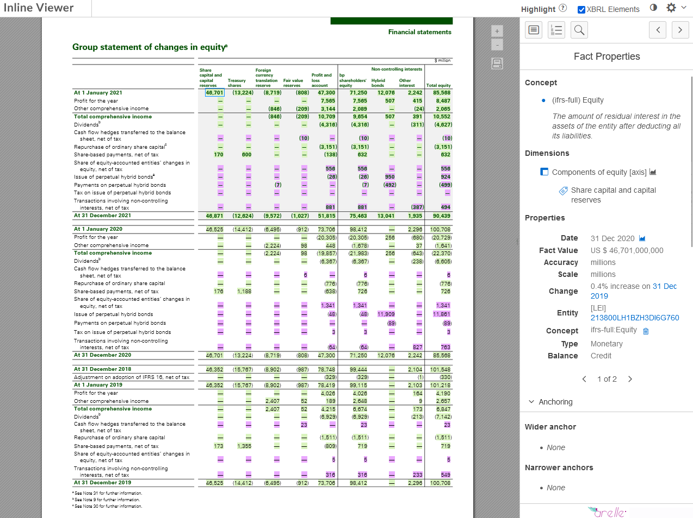
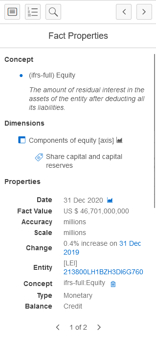
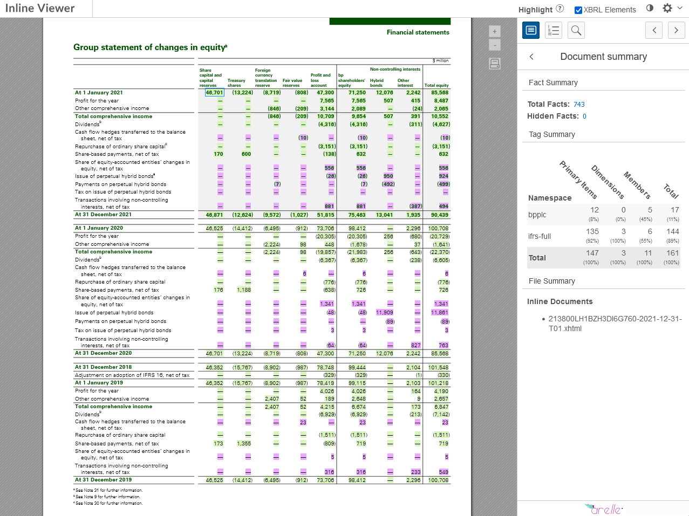
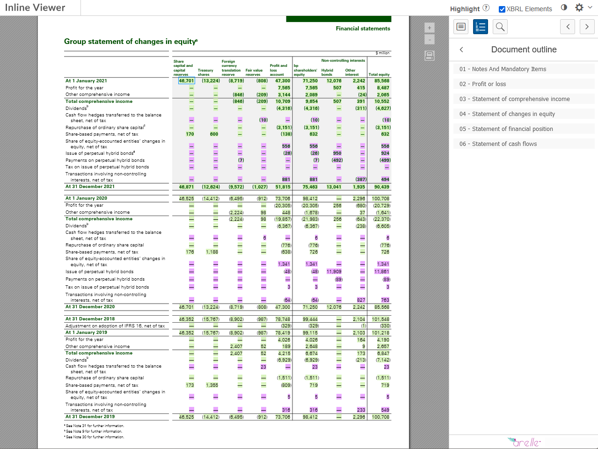
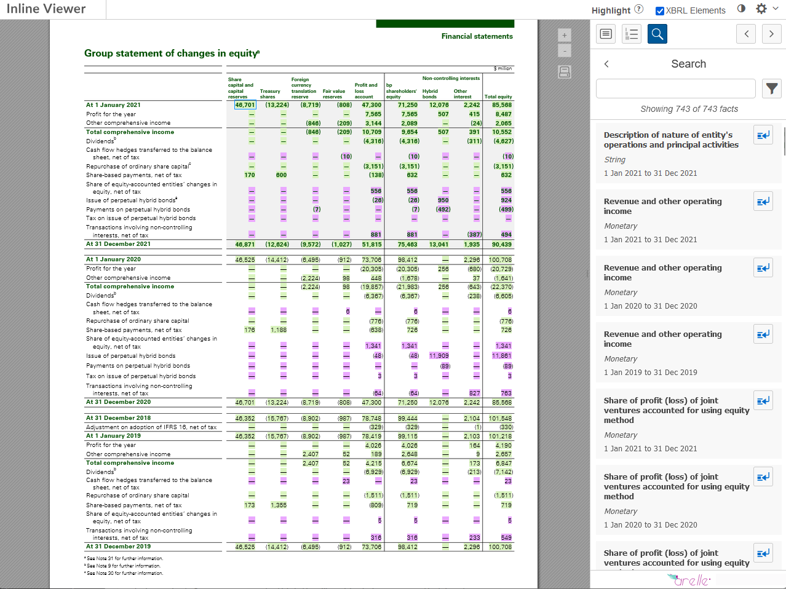
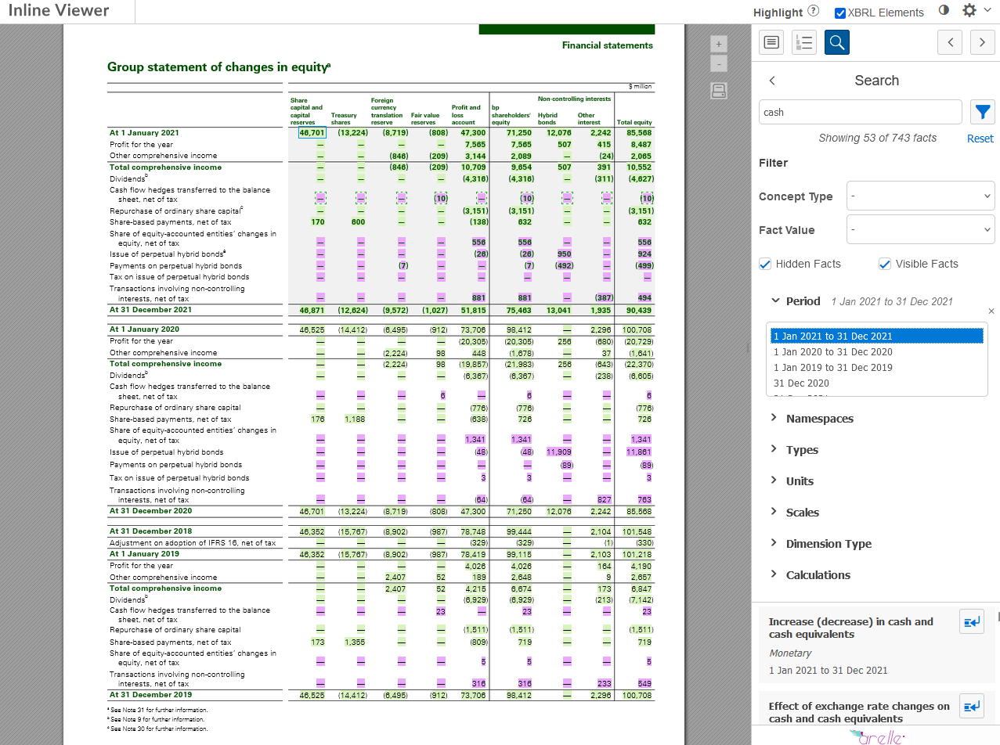
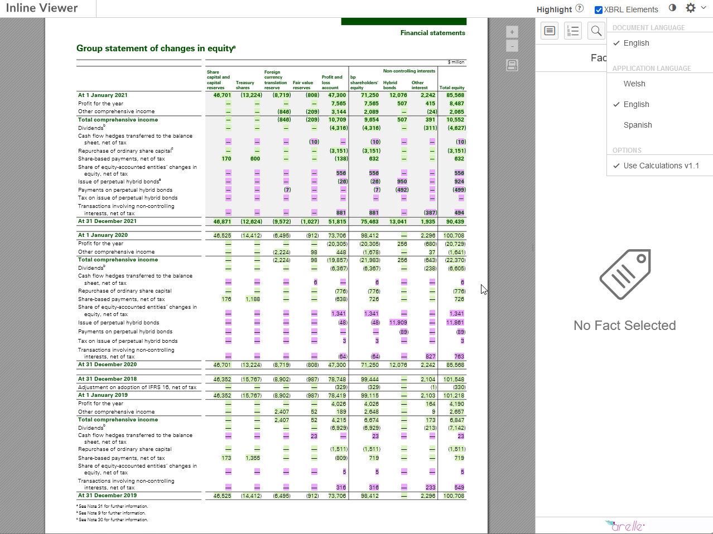

# User Guide

:::{index} User Guide
:::

## Overview

The Arelle Inline XBRL (iXBRL) Viewer allows you to access, view and
interact with tagged XBRL data in iXBRL documents from your web browser.

Key features include:

-   Full text search on taxonomy labels and references
-   View full details of tagged facts
-   Export tables to Excel
-   Visualise and navigate calculation relationships
-   Produce on-the-fly graphs using XBRL data

## Viewing the Report

The Inline XBRL Viewer consists of the following components:

-   Viewer pane - This area, taking up most of the screen, shows the
    filed document.
-   XBRL inspector - This area on the right shows information about the
    currently-selected fact and allows navigation of the document using
    XBRL Information.
-   Toolbar - This area along the top of the viewer contains general
    controls for the viewer..

The viewer pane allows you to browse information in the report that has
been tagged as XBRL by clicking on it to see tag details in the XBRL
inspector. The viewer pane has controls for zooming and printing the
Inline XBRL document, andalso for exporting the data in individual
tables.

You can also navigate between facts in the document using the left and
right arrows at the top of the XBRL inspector. Moving between facts will
move the viewing area to the selected fact and highlight the tagged
information in the viewer pane. Some XBRL tags contain information that
is not shown in the document. These are referred to as "hidden facts"
and are indicated by a "hidden fact" message at the top of the XBRL
inspector when selected. No information will be highlighted in the
viewer pane when a hidden fact is selected.

### Highlighting Facts

The "Highlight XBRL Elements" checkbox on the toolbar can be used to
highlight all tagged information in the document. Different colors
represent different namespaces, which can be seen by hovering over the
(?) icon. Note that not all of the namespaces used by the document may
be visible if, for example, a given namespace is only used in
dimensions.

## Fact Properties

When an XBRL fact is selected, information about the fact will be shown
in the XBRL inspector. This includes:

-   Concept name
-   Concept description
-   Dimensions (if any)
-   Date or date range
-   Fact value
-   Accuracy
-   Scale
-   Change
-   Entity
-   Concept
-   Type
-   Balance
-   Concept Labels
-   Concept References
-   Anchoring information (if applicable)
-   Calculations (if applicable)
-   Footnotes (if applicable)
-   Sections

### Analysis charts

The icon next to the Date property will display a chart of the
currently-selected fact compared against correspondingly-tagged facts
from other periods in the report. If the fact has dimensions, each
dimension will also have an icon you can click to show a chart of the
currently-selected fact compared against correspondingly-tagged facts
with different values for that dimension. For example, if a dimension is
used to provide a breakdown by business segment, the chart will show the
correspondingly-tagged fact for each business segment. Dimensions shown
on the chart can be toggled using the buttons below the chart. Up to two
dimensions can be plotted at a time.

### Change from prior period

The Change property shows the percentage change of the current fact
compared to the corresponding value from the prior period, if such a
tagged value exists. Clicking on the comparative period will focus the
fact inspector on the prior period fact.

### Entity information

The Entity property shows the entity identifier that the fact is
reported against. Typically this will be the same for all facts in the
report and will be either the UK Company Registration number or the
Legal Entity Identifier. You can click the link to search the identifier
on the Companies House or GLEIF website in a new browser tab.

### Fact locations

If the current fact appears in more than one location in the document,
the left and right arrow buttons at the bottom of the properties pane
can be used to cycle through the different occurrences.

## XBRL Inspector Panels

By default, the XBRL Inspector will show the Fact Properties panel,
which shows information about the currently selected fact. The inspector
has three other modes, which can be selected using the icons at the top
of the XBRL Inspector:

-   Document Summary
-   Document Outline
-   Search

To return to the Fact Properties panel, click on the same icon again or
use the back button to the left of the panel title.

### Document Summary

The Document Summary mode shows information about the XBRL data in the
document, including the total number of XBRL facts, the number of hidden
facts and files included in the filing. The summary also includes the
number of distinct concepts, dimensions and members in the report. You
can click on the fact count to enter Search mode.

::: note
::: title
Note
:::

The number of concepts will be less than the total number of facts, as
concepts will often be reported for different periods and with different
dimensions.
:::

### Document Outline

The List icon toggles the Document Outline panel, which displays
sections of the document based on the structure of the XBRL Taxonomy
used to tag the document. Select a section to move to the start of that
section in the document.

### Search

The magnifying glass icon toggles the Search panel, where a powerful
search function allows you to find information in the document using
XBRL data. By default, all XBRL facts in the document are displayed in
the search results. You can use the search and filter controls at the
top of the search panel to examine a fact or facts more closely.

Entering terms into the search bar of the Search panel shows a list of
matching facts from the report. The search will match against
information from the XBRL Taxonomy, including concept and dimension
labels. The results are ordered according to match quality, with the
best matches shown first. Entering multiple search terms will show all
facts that match at least one term. Prefixing a search term with "+"
will restrict the results to those that contain that term.

Selecting a fact in the results will scroll the viewer pane to that fact
at its location in the document. Double clicking on a fact in the
results or using the arrow icon will close the search panel and focus on
that fact in the Fact Properties panel.

Search results can be customised using the filter functionality accessed
using the filter icon to the right of the search bar. Apply filters by
checking or unchecking boxes, by selecting the filter dropdown and
making a selection, or by choosing an option from the filter category.

The filter icon will be highlighted to indicate when there are active
filters, and a "reset" link will appear that will remove all filters.
Clicking on the filter icon again will close the filter controls, but
the filters will remain active.

Filters include:

-   Concept type
-   Fact value
-   Hidden (or visible) facts
-   Period
-   Namespaces
-   Types
-   Units
-   Scales
-   Dimension type
-   Calculations

## Table Export

Tables containing XBRL tags have a green diamond icon in the top left
corner. Mousing over this icon will show an "Export Table" link.
Clicking this will export data from the table as an Excel spreadsheet.

The exported table will include the descriptions used in the document
alongside the labels for the XBRL concepts and dimensions used to tag
the facts in the currently selected document language. This feature can
be used to review documents that have been prepared in a different
language.

## Toolbar Controls

Checking the "Highlight XBRL Elements" option on the toolbar will
highlight all information in the document tagged with XRBL. The
highlighting is colour-coded to indicate which taxonomy (or part of a
taxonomy) was used to tag the fact. You can view a key for highlight
colours by mousing over the question mark icon in the toolbar.

The toolbar also has the following controls:

-   Dark Mode - selecting the dark mode icon at the top of the Fact
    Properties panel will toggle "dark mode". Dark mode changes the
    interface to use light text on a dark background.
-   Settings Menu - the gear icon on the right of the toolbar provides a
    menu with a number of viewer settings. These include:
    -   Document language -- if the XBRL taxonomy used to prepare the
        document contains more than one language, you can choose the
        language here to adjust the language used when displaying labels
        for concepts, dimensions and members.
    -   Application language -- this controls the language of the Inline
        XBRL Viewer user interface.
-   Calculations mode - the "Calculations v1.1" checkbox controls how
    numeric facts in the document are checked against calculation
    relationships in the XBRL Taxonomy. It is recommended that
    Calculations v1.1 is enabled.

