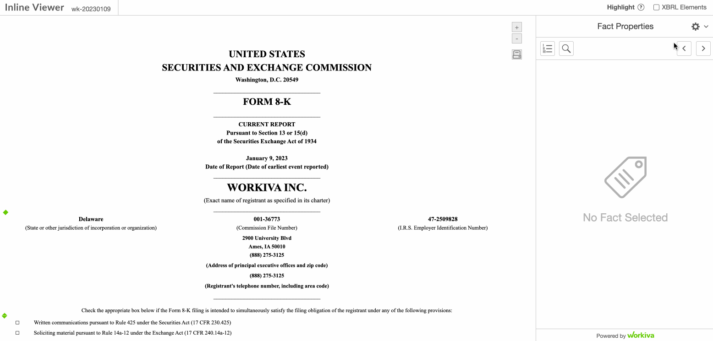
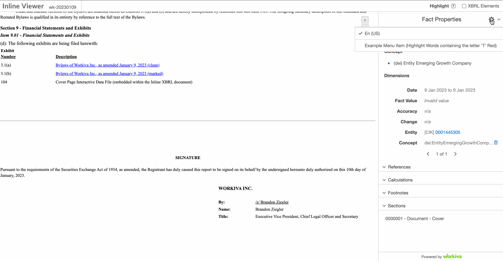

# Examples
This directory aims to provide some demo material for those looking to jump in and start using the ixbrl-viewer.

## Workiva's January 2023 8-K filing
Provided here is an example of Workiva's January 2023 8-K filing as an ixbrl-viewer that highlights some of the key features

### What is going on?
The ixbrl-viewer is taking the Workiva's January 2023 8-K filing:
- [workiva-january-2023-8-k-filing-index-hosting](https://filingindex.arelle.org/filing?id=0001445305-23-000007)
- [workiva-january-2023-8-k-sec-hosting](https://www.sec.gov/Archives/edgar/data/1445305/000144530523000007/0001445305-23-000007-index.htm)

And wraps it with javascript to create a viewer output: 
- [workiva-8k-filing-ixbrl-viewer](workiva-january-2023-8-k-ixbrl-viewer/ixbrl-viewer.htm)

## Multi Document Filings
This example demonstrates the ixbrl-viewers multi document filing capabilities:
- [clorox-2022-10-K-ixbrl-viewer](clorox-2022-10-K-ixbrl-viewer/ixbrl-viewer.htm)

## Example Plugin
There is an [example plugin](example_plugin/README.md) that makes use of the [plugin architecture](../PLUGINS.md) for those looking to extend the viewer.

